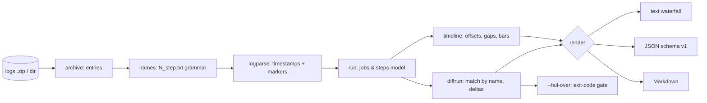

# ciblame

[English](README.md) | [中文](README.zh.md) | [日本語](README.ja.md)

[](LICENSE) [](go.mod) [](CHANGELOG.md)  [](CONTRIBUTING.md)

**ciblame：ダウンロードした GitHub Actions のログアーカイブをステップ単位のウォーターフォールに解析し、2 つの実行間のタイミング差分を取るオープンソース・依存ゼロの CLI —— 完全オフライン、Marketplace アプリなし、トークンなし、ダッシュボードサービスなし。**


```bash
git clone https://github.com/JaydenCJ/ciblame && cd ciblame
go build -o ciblame ./cmd/ciblame    # single static binary, stdlib only
```

> プレリリース：v0.1.0 はまだどのパッケージレジストリにもタグ付けされていません。上記の手順でソースからビルドしてください（Go ≥1.22 なら何でも可）。

## なぜ ciblame？

「CI が 4 分遅くなった —— どのステップ？」はエンジニアリングで最も頻出なのに最も答えにくい質問の一つです。CI の分数はお金そのものなのに、Actions の UI は時間の行き先を隠します —— *単一*の実行のステップ時間を折りたたみの中に表示するだけで、ウォーターフォールも、オーバーヘッドの集計も、2 つの実行を比較する手段もありません。既存の答えはすべてオンラインを強いてきます —— CI 分析 SaaS はリポジトリの読み取り権限を持つ Marketplace アプリを要求し、`gh run view` はトークンが必要な上フラットな一覧しか出ず、API スクリプトはレート制限で潰れてスプリントとともに息絶えます。しかし必要なものはすべて、GitHub が誰にでもダウンロードさせるログアーカイブの中に既にあります：全ステップの全行に 100 ns 精度のタイムスタンプが付いています。ciblame はその zip —— あるいは展開済みディレクトリ —— を読み、ステップ間オーバーヘッド付きのジョブ別ウォーターフォールを生成し、ジョブ横断で最も遅いステップをランク付けし、2 つのアーカイブをステップ*名*でマッチングして比較します（番号の振り直しではペアリングが壊れない）。犯人は出力の 1 行目です。電車の中でも、エアギャップ環境でも、保持ポリシーが UI から消し去った何年も前の実行のアーカイブでも動きます。

| | ciblame | Actions 実行ページ | gh run view | CI 分析 SaaS |
|---|---|---|---|---|
| ダウンロード済みログでオフライン動作 | ✅ | ❌ | ❌ トークン必須 | ❌ |
| オーバーヘッド集計付きステップウォーターフォール | ✅ | ❌ 折りたたみのみ | ❌ フラット一覧 | 部分的 |
| 2 つの実行間のタイミング差分 | ✅ | ❌ | ❌ | ✅ 自社履歴のみ |
| 退化したステップを 1 行目で名指し | ✅ | ❌ | ❌ | まちまち |
| 終了コード付きのリグレッションゲート | ✅ | ❌ | ❌ | ❌ webhook ダッシュボード |
| Marketplace アプリ / リポジトリ権限の要否 | 不要 | 対象外 | トークン | リポジトリ読み取り権限 |
| ランタイム依存 | 0 | 対象外 | Go バイナリ + 認証 | SaaS |

<sub>2026-07-13 時点で確認：ciblame は Go 標準ライブラリのみを import し、ソケットを一切開きません。アーカイブ自体は実行ページの「Download log archive」ボタンか 1 回の `gh api` 呼び出しで取得でき、以後はすべてローカルです。</sub>

## 機能

- **生ログからステップウォーターフォール** —— 各ジョブが、開始オフセット・所要時間・比例トラックバーの揃った表になります。計時は runner 自身の 100 ns タイムスタンプ。
- **犯人を名指しする実行間差分** —— ジョブとステップはアーカイブをまたいで名前でマッチし、番号の振り直し・ステップの挿入・同名ステップにも耐えます。出力はインパクト順なので答えは 1 行目。
- **オーバーヘッドは一級市民** —— ステップの*あいだ*の秒数（コンテナ準備、成果物の帳簿付け）をジョブごとに合計します。それも同じように課金されるからです。
- **強制できるリグレッション予算** —— `ciblame diff --fail-over 60s` は総ジョブ時間が予算を超えた瞬間に終了コード 1 で終了し、リリースチェックリストにそのまま組み込めます。`--min-delta` はしきい値未満のノイズを正直な 1 行のサマリに畳みます。
- **3 つの出力形式** —— ターミナル向けの人間用ウォーターフォール、スクリプト向けの安定 JSON（`schema_version: 1`）、PR にそのまま貼れる Markdown 表。
- **フォーマットの癖を理解** —— ステップ別ファイルがないアーカイブへの結合ログフォールバック、endgroup 消失に耐える `##[group]` 折りたたみ計時、失敗ステップ検出、macOS の zip ゴミ、拡張子なしの API ダウンロード、runner イメージのメタデータ。
- **依存ゼロ・完全オフライン** —— Go 標準ライブラリのみ。Marketplace アプリなし、トークンなし、テレメトリなし、ネットワーク接続は一切なし。

## クイックスタート

```bash
# fabricate two demo archives (or download real ones: run page → "Download log archive")
go run ./examples/make-demo-archive demo

./ciblame report demo/base.zip
```

実際にキャプチャした出力（2 つのデモジョブのうち最初のもの。`lint` ジョブが同じ形式で続きます）：

```text
ciblame report — base.zip
2 jobs · 11 steps · wall 2m10s · job time 3m00s

job build · 2m10s · 8 steps · started 10:00:00Z · ubuntu-24.04
   #  step                      start       dur
   1  Set up job                +0.0s      2.4s  █░░░░░░░░░░░░░░░░░░░░░░░░░░░
   2  Checkout                  +2.6s      1.8s  █░░░░░░░░░░░░░░░░░░░░░░░░░░░
   3  Set up Go                 +4.6s      7.5s  ███░░░░░░░░░░░░░░░░░░░░░░░░░
   4  Restore module cache     +12.3s      8.0s  ░░██░░░░░░░░░░░░░░░░░░░░░░░░
   5  Build                    +20.5s     38.0s  ░░░░█████████░░░░░░░░░░░░░░░
   6  Run unit tests           +58.7s     1m02s  ░░░░░░░░░░░░██████████████░░
   7  Upload artifact          +2m01s      8.5s  ░░░░░░░░░░░░░░░░░░░░░░░░░░██
   8  Post Checkout            +2m10s      0.5s  ░░░░░░░░░░░░░░░░░░░░░░░░░░░█
  between-step overhead: 1.4s (1.1% of the job)
```

一週間後、CI が 4 分ほど遅く感じられます。どのステップか聞いてみましょう（`ciblame diff`、実出力）：

```text
ciblame diff — base.zip → head.zip
job time    3m00s → 7m03s    +4m02s (+134.4%)
wall        2m10s → 6m11s    +4m01s

job build  +4m01s  (2m10s → 6m11s)
  ~ Run unit tests                1m02s → 4m26s        +3m24s  ████████████████
  ~ Restore module cache           8.0s → 31.8s        +23.8s  █
  + Generate coverage report          — → 12.5s        +12.5s  █
  · 6 steps within ±2.0s (net +0.0s)

job lint (ubuntu-latest)  +1.8s  (50.2s → 52.0s)
  · 3 steps within ±2.0s (net +1.8s)
```

あるいは全ジョブ横断で最も遅いステップをランク付け（`ciblame slow --top 3`、実出力）：

```text
ciblame slow — head.zip · top 3 of 12 steps · job time 7m03s

       dur   share  job · step
     4m26s   62.9%  build · Run unit tests
     47.8s   11.3%  lint (ubuntu-latest) · Run golangci-lint
     38.0s    9.0%  build · Build
```

## CLI リファレンス

`ciblame [report|slow|diff|version] [flags] <archive…>` —— デフォルトのサブコマンドは `report`。アーカイブとは実行ページからダウンロードしたログ zip（または `gh api …/runs/ID/logs > run.zip`）で、zip のままでも展開済みディレクトリでも構いません。終了コード：0 正常、1 `--fail-over` 超過、2 使い方エラー、3 実行時エラー。

| フラグ | デフォルト | 効果 |
|---|---|---|
| `--format` | `text` | `text`・`json`・`markdown`（`slow` は `text`/`json`） |
| `--job` | — | 名前にこの部分文字列を含むジョブだけを対象にする。大文字小文字無視（繰り返し可） |
| `--width`（report） | `28` | ウォーターフォールのトラック幅（セル数、8–120） |
| `--groups`（report） | オフ | 各ステップの下に最も遅い `##[group]` 折りたたみを表示 |
| `--top`（slow） | `10` | ランキングに載せるステップ数 |
| `--min-delta`（diff） | `2s` | \|delta\| がこれ未満のステップを 1 行のサマリに畳む |
| `--fail-over`（diff） | 未設定 | 総ジョブ時間の増加がこれを超えたら終了コード 1 |

JSON 出力は常に `{"tool": "ciblame", "schema_version": 1, "kind": …}` を伴い、所要時間は秒、タイムスタンプは RFC 3339 です。`diff --format json` は全ステップを無フィルタで含み、しきい値判定は機械側に委ねます。ciblame が依拠するアーカイブのレイアウトと行文法 —— そしてアーカイブが本質的に語れないこと（キュー待ち時間、課金倍率）—— は [docs/log-format.md](docs/log-format.md) に文書化しています。

## 検証

このリポジトリは CI を一切同梱しません。上記の主張はすべてローカル実行で検証します：

```bash
go test ./...            # 87 deterministic tests, offline, < 5 s
bash scripts/smoke.sh    # end-to-end CLI check, prints SMOKE OK
```

## アーキテクチャ



## ロードマップ

- [x] v0.1.0 —— zip/ディレクトリ読み込み、オーバーヘッド集計付きステップウォーターフォール、折りたたみ計時、最遅ステップランキング、名前マッチングの実行差分と `--fail-over` ゲート、text/JSON/Markdown 出力、87 テスト + smoke スクリプト
- [ ] 複数実行のトレンド（`ciblame trend *.zip`）で特定ステップの所要時間を週単位でグラフ化
- [ ] 結合ジョブログからのステップ境界の復元（ステップ別ファイルのない古いアーカイブ）
- [ ] コストモード：OS 別課金倍率で macOS の分数に本当の値段を表示
- [ ] `--per-job` のジョブ別 diff 予算と、ゲート結果の JUnit 風レポート
- [ ] ウォーターフォールを単一の自己完結ファイルで共有できるフレームグラフ風 HTML エクスポート

全リストは [open issues](https://github.com/JaydenCJ/ciblame/issues) を参照してください。

## コントリビュート

issue・ディスカッション・PR を歓迎します —— ローカルのワークフロー（フォーマット、vet、テスト、`SMOKE OK`）は [CONTRIBUTING.md](CONTRIBUTING.md) を参照。入門向けタスクは [good first issue](https://github.com/JaydenCJ/ciblame/issues?q=is%3Aissue+is%3Aopen+label%3A%22good+first+issue%22) のラベル付き、設計の議論は [Discussions](https://github.com/JaydenCJ/ciblame/discussions) で。

## ライセンス

[MIT](LICENSE)
