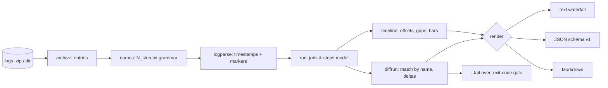

# ciblame

[English](README.md) | [中文](README.zh.md) | [日本語](README.ja.md)

[](LICENSE) [](go.mod) [](CHANGELOG.md)  [](CONTRIBUTING.md)

**ciblame：an open-source, zero-dependency CLI that parses downloaded GitHub Actions log archives into per-step waterfalls and diffs timing across runs — fully offline, no marketplace app, no tokens, no dashboard service.**


```bash
git clone https://github.com/JaydenCJ/ciblame && cd ciblame
go build -o ciblame ./cmd/ciblame    # single static binary, stdlib only
```

> Pre-release: v0.1.0 is not tagged on a package registry yet; build from source as above (any Go ≥1.22).

## Why ciblame?

"Our CI got four minutes slower — which step?" is one of the most common and least answerable questions in engineering, because CI minutes are money and the Actions UI hides where they go: it shows per-step times for *one* run behind collapsing folds, offers no waterfall, no overhead accounting, and nothing that compares two runs. The existing answers all pull you online — CI-analytics SaaS wants a marketplace app with read access to your repos, `gh run view` needs a token and shows a flat list, and API scripts get rate-limited and die with the sprint. Yet everything needed is already in the log archive GitHub lets anyone download: every line of every step is timestamped to 100 ns. ciblame reads that zip — or the directory you unzipped — and turns it into a per-job step waterfall with between-step overhead, ranks the slowest steps across jobs, and diffs two archives by matching steps by *name* (so renumbering doesn't break pairing), printing the culprit on the first line. It runs on the train, on an air-gapped machine, and on archives of runs your retention policy deleted from the UI years ago.

| | ciblame | Actions run page | gh run view | CI-analytics SaaS |
|---|---|---|---|---|
| Works offline on downloaded logs | ✅ | ❌ | ❌ needs token | ❌ |
| Step waterfall with overhead accounting | ✅ | ❌ folds only | ❌ flat list | partial |
| Diffs timing across two runs | ✅ | ❌ | ❌ | ✅ own history only |
| Names the regressed step first | ✅ | ❌ | ❌ | varies |
| Regression gate with exit codes | ✅ | ❌ | ❌ | ❌ webhook dashboards |
| Marketplace app / repo access required | none | n/a | token | read access to repos |
| Runtime dependencies | 0 | n/a | Go binary + auth | SaaS |

<sub>Checked 2026-07-13: ciblame imports the Go standard library only and never opens a socket; the archive itself comes from the run page's "Download log archive" button or one `gh api` call, after which everything is local.</sub>

## Features

- **Step waterfalls from raw logs** — every job becomes an aligned table of steps with start offset, duration, and a proportional track bar, timed from the runner's own 100 ns timestamps.
- **Run-to-run diffing that names the culprit** — jobs and steps match by name across archives, surviving renumbering, inserted steps, and duplicate step names; output is sorted by impact so the answer is the first line.
- **Overhead is a first-class number** — the seconds *between* steps (container setup, artifact bookkeeping) are summed per job, because they bill like everything else.
- **A regression budget you can enforce** — `ciblame diff --fail-over 60s` exits 1 the moment total job time grows past the budget, ready for release checklists; `--min-delta` folds sub-threshold noise into one honest summary line.
- **Three output formats** — human waterfalls for terminals, stable JSON (`schema_version: 1`) for scripts, and PR-ready Markdown tables.
- **Understands the format's warts** — combined-log fallback for archives without per-step files, `##[group]` fold timing with lost-endgroup recovery, failed-step detection, macOS zip litter, extension-less API downloads, runner image metadata.
- **Zero dependencies, fully offline** — Go standard library only; no marketplace app, no tokens, no telemetry, no network, ever.

## Quickstart

```bash
# fabricate two demo archives (or download real ones: run page → "Download log archive")
go run ./examples/make-demo-archive demo

./ciblame report demo/base.zip
```

Real captured output (first of the two demo jobs; the `lint` job follows in the same shape):

```text
ciblame report — base.zip
2 jobs · 11 steps · wall 2m10s · job time 3m00s

job build · 2m10s · 8 steps · started 10:00:00Z · ubuntu-24.04
   #  step                      start       dur
   1  Set up job                +0.0s      2.4s  █░░░░░░░░░░░░░░░░░░░░░░░░░░░
   2  Checkout                  +2.6s      1.8s  █░░░░░░░░░░░░░░░░░░░░░░░░░░░
   3  Set up Go                 +4.6s      7.5s  ███░░░░░░░░░░░░░░░░░░░░░░░░░
   4  Restore module cache     +12.3s      8.0s  ░░██░░░░░░░░░░░░░░░░░░░░░░░░
   5  Build                    +20.5s     38.0s  ░░░░█████████░░░░░░░░░░░░░░░
   6  Run unit tests           +58.7s     1m02s  ░░░░░░░░░░░░██████████████░░
   7  Upload artifact          +2m01s      8.5s  ░░░░░░░░░░░░░░░░░░░░░░░░░░██
   8  Post Checkout            +2m10s      0.5s  ░░░░░░░░░░░░░░░░░░░░░░░░░░░█
  between-step overhead: 1.4s (1.1% of the job)
```

A week later CI feels four minutes slower. Ask which step (`ciblame diff`, real output):

```text
ciblame diff — base.zip → head.zip
job time    3m00s → 7m03s    +4m02s (+134.4%)
wall        2m10s → 6m11s    +4m01s

job build  +4m01s  (2m10s → 6m11s)
  ~ Run unit tests                1m02s → 4m26s        +3m24s  ████████████████
  ~ Restore module cache           8.0s → 31.8s        +23.8s  █
  + Generate coverage report          — → 12.5s        +12.5s  █
  · 6 steps within ±2.0s (net +0.0s)

job lint (ubuntu-latest)  +1.8s  (50.2s → 52.0s)
  · 3 steps within ±2.0s (net +1.8s)
```

Or rank the slowest steps across all jobs (`ciblame slow --top 3`, real output):

```text
ciblame slow — head.zip · top 3 of 12 steps · job time 7m03s

       dur   share  job · step
     4m26s   62.9%  build · Run unit tests
     47.8s   11.3%  lint (ubuntu-latest) · Run golangci-lint
     38.0s    9.0%  build · Build
```

## CLI reference

`ciblame [report|slow|diff|version] [flags] <archive…>` — `report` is the default. An archive is the logs zip from the run page (or `gh api …/runs/ID/logs > run.zip`), zipped or already extracted. Exit codes: 0 ok, 1 `--fail-over` breach, 2 usage error, 3 runtime error.

| Flag | Default | Effect |
|---|---|---|
| `--format` | `text` | `text`, `json`, or `markdown` (`slow`: `text`/`json`) |
| `--job` | — | only include jobs whose name contains this, case-insensitive (repeatable) |
| `--width` (report) | `28` | waterfall track width in cells (8–120) |
| `--groups` (report) | off | show each step's slowest `##[group]` folds beneath it |
| `--top` (slow) | `10` | how many steps to rank |
| `--min-delta` (diff) | `2s` | fold steps whose \|delta\| is smaller into one summary line |
| `--fail-over` (diff) | unset | exit 1 when total job time grows by more than this |

JSON output always carries `{"tool": "ciblame", "schema_version": 1, "kind": …}` with durations as seconds and RFC 3339 timestamps; `diff --format json` includes every step unfiltered so machines do their own thresholding. The archive layout and line grammar ciblame relies on — and what the archive fundamentally cannot tell you (queue times, billing multipliers) — are documented in [docs/log-format.md](docs/log-format.md).

## Verification

This repository ships no CI; every claim above is verified by local runs:

```bash
go test ./...            # 87 deterministic tests, offline, < 5 s
bash scripts/smoke.sh    # end-to-end CLI check, prints SMOKE OK
```

## Architecture



## Roadmap

- [x] v0.1.0 — zip/directory loading, step waterfalls with overhead accounting, fold timing, slowest-steps ranking, name-matched run diffing with `--fail-over` gate, text/JSON/Markdown output, 87 tests + smoke script
- [ ] Multi-run trends (`ciblame trend *.zip`) to chart a step's duration over weeks
- [ ] Reconstruct step boundaries from combined job logs (older archives without per-step files)
- [ ] Cost mode: per-OS billing multipliers so macOS minutes show their real price
- [ ] `--per-job` diff budgets and a JUnit-style report for gate results
- [ ] Flame-style HTML export for sharing a waterfall as one self-contained file

See the [open issues](https://github.com/JaydenCJ/ciblame/issues) for the full list.

## Contributing

Issues, discussions and pull requests are welcome — see [CONTRIBUTING.md](CONTRIBUTING.md) for the local workflow (format, vet, tests, `SMOKE OK`). Good entry points are labelled [good first issue](https://github.com/JaydenCJ/ciblame/issues?q=is%3Aissue+is%3Aopen+label%3A%22good+first+issue%22), and design questions live in [Discussions](https://github.com/JaydenCJ/ciblame/discussions).

## License

[MIT](LICENSE)
