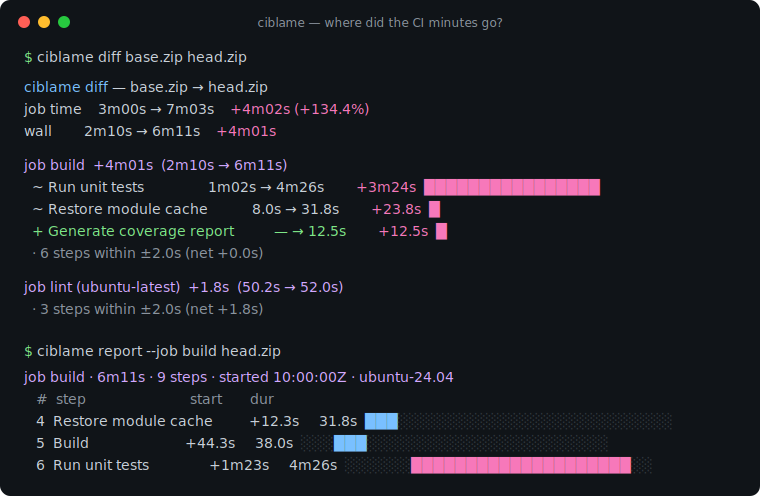
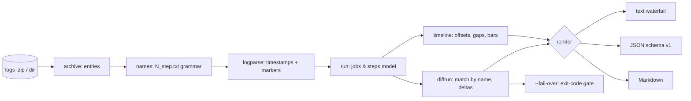

# ciblame

[English](README.md) | [中文](README.zh.md) | [日本語](README.ja.md)

[](LICENSE) [](go.mod) [](CHANGELOG.md)  [](CONTRIBUTING.md)

**ciblame：开源、零依赖的 CLI，把下载的 GitHub Actions 日志归档解析成逐步骤瀑布图，并对比两次运行的耗时差异 —— 完全离线，无 Marketplace 应用、无 token、无仪表盘服务。**



```bash
git clone https://github.com/JaydenCJ/ciblame && cd ciblame
go build -o ciblame ./cmd/ciblame    # single static binary, stdlib only
```

> 预发布：v0.1.0 尚未在任何包仓库打 tag；请按上面的方式从源码构建（任意 Go ≥1.22）。

## 为什么选 ciblame？

“我们的 CI 慢了四分钟 —— 是哪一步？”是工程团队最常见却最难回答的问题之一：CI 分钟就是钱，而 Actions 界面把时间的去向藏了起来 —— 它只在折叠区里展示*单次*运行的步骤耗时，没有瀑布图、没有开销核算、更没有任何跨运行对比。现有的答案全都逼你上线：CI 分析 SaaS 要求安装能读你仓库的 Marketplace 应用，`gh run view` 需要 token 且只有平铺列表，API 脚本会被限流、随冲刺一起夭折。可需要的一切其实早就在 GitHub 允许任何人下载的日志归档里：每个步骤的每一行都带 100 ns 精度的时间戳。ciblame 读取那个 zip —— 或你解压出的目录 —— 生成带步骤间开销的逐作业瀑布图、跨作业排出最慢步骤，并按*名称*匹配步骤来对比两个归档（因此重新编号不会破坏配对），第一行就是罪魁祸首。它能在火车上跑、在离线隔离机上跑，也能跑在保留策略早已从界面删掉的多年前运行的归档上。

| | ciblame | Actions 运行页 | gh run view | CI 分析 SaaS |
|---|---|---|---|---|
| 在下载的日志上离线工作 | ✅ | ❌ | ❌ 需要 token | ❌ |
| 带开销核算的步骤瀑布图 | ✅ | ❌ 只有折叠区 | ❌ 平铺列表 | 部分 |
| 对比两次运行的耗时 | ✅ | ❌ | ❌ | ✅ 仅限自家历史 |
| 第一行点名退化的步骤 | ✅ | ❌ | ❌ | 不一定 |
| 带退出码的回归门禁 | ✅ | ❌ | ❌ | ❌ webhook 仪表盘 |
| 是否要 Marketplace 应用 / 仓库权限 | 都不要 | 不适用 | token | 仓库读权限 |
| 运行时依赖 | 0 | 不适用 | Go 二进制 + 鉴权 | SaaS |

<sub>核对于 2026-07-13：ciblame 只导入 Go 标准库，从不打开任何 socket；归档本身来自运行页的 “Download log archive” 按钮或一次 `gh api` 调用，此后一切都在本地。</sub>

## 功能特性

- **从原始日志生成步骤瀑布图** —— 每个作业变成一张对齐的步骤表：起始偏移、耗时、按比例绘制的轨道条，全部以 runner 自己的 100 ns 时间戳计时。
- **点名罪魁祸首的跨运行对比** —— 作业与步骤跨归档按名称匹配，插入步骤、重新编号、重名步骤都不影响配对；输出按影响排序，答案就在第一行。
- **开销是一等公民** —— 步骤*之间*的秒数（容器准备、产物记账）按作业求和，因为它们同样计费。
- **可强制执行的回归预算** —— `ciblame diff --fail-over 60s` 在总作业时间超出预算的那一刻以退出码 1 退出，可直接接入发布检查单；`--min-delta` 把阈值以下的噪声折叠成一行诚实的摘要。
- **三种输出格式** —— 给终端看的人类瀑布图、给脚本用的稳定 JSON（`schema_version: 1`）、可直接贴进 PR 的 Markdown 表格。
- **理解格式的各种坑** —— 无逐步骤文件时回退到合并日志、`##[group]` 折叠计时并恢复丢失的 endgroup、失败步骤检测、macOS zip 垃圾、无扩展名的 API 下载、runner 镜像元数据。
- **零依赖、完全离线** —— 只用 Go 标准库；没有 Marketplace 应用、没有 token、没有遥测、永不联网。

## 快速上手

```bash
# fabricate two demo archives (or download real ones: run page → "Download log archive")
go run ./examples/make-demo-archive demo

./ciblame report demo/base.zip
```

真实抓取的输出（两个演示作业中的第一个；`lint` 作业以同样的形式紧随其后）：

```text
ciblame report — base.zip
2 jobs · 11 steps · wall 2m10s · job time 3m00s

job build · 2m10s · 8 steps · started 10:00:00Z · ubuntu-24.04
   #  step                      start       dur
   1  Set up job                +0.0s      2.4s  █░░░░░░░░░░░░░░░░░░░░░░░░░░░
   2  Checkout                  +2.6s      1.8s  █░░░░░░░░░░░░░░░░░░░░░░░░░░░
   3  Set up Go                 +4.6s      7.5s  ███░░░░░░░░░░░░░░░░░░░░░░░░░
   4  Restore module cache     +12.3s      8.0s  ░░██░░░░░░░░░░░░░░░░░░░░░░░░
   5  Build                    +20.5s     38.0s  ░░░░█████████░░░░░░░░░░░░░░░
   6  Run unit tests           +58.7s     1m02s  ░░░░░░░░░░░░██████████████░░
   7  Upload artifact          +2m01s      8.5s  ░░░░░░░░░░░░░░░░░░░░░░░░░░██
   8  Post Checkout            +2m10s      0.5s  ░░░░░░░░░░░░░░░░░░░░░░░░░░░█
  between-step overhead: 1.4s (1.1% of the job)
```

一周后 CI 感觉慢了四分钟。问问是哪一步（`ciblame diff`，真实输出）：

```text
ciblame diff — base.zip → head.zip
job time    3m00s → 7m03s    +4m02s (+134.4%)
wall        2m10s → 6m11s    +4m01s

job build  +4m01s  (2m10s → 6m11s)
  ~ Run unit tests                1m02s → 4m26s        +3m24s  ████████████████
  ~ Restore module cache           8.0s → 31.8s        +23.8s  █
  + Generate coverage report          — → 12.5s        +12.5s  █
  · 6 steps within ±2.0s (net +0.0s)

job lint (ubuntu-latest)  +1.8s  (50.2s → 52.0s)
  · 3 steps within ±2.0s (net +1.8s)
```

或者跨所有作业排出最慢步骤（`ciblame slow --top 3`，真实输出）：

```text
ciblame slow — head.zip · top 3 of 12 steps · job time 7m03s

       dur   share  job · step
     4m26s   62.9%  build · Run unit tests
     47.8s   11.3%  lint (ubuntu-latest) · Run golangci-lint
     38.0s    9.0%  build · Build
```

## CLI 参考

`ciblame [report|slow|diff|version] [flags] <archive…>` —— 默认子命令是 `report`。归档即运行页下载的日志 zip（或 `gh api …/runs/ID/logs > run.zip`），可以是 zip 也可以是已解压目录。退出码：0 正常，1 `--fail-over` 超限，2 用法错误，3 运行时错误。

| 参数 | 默认值 | 作用 |
|---|---|---|
| `--format` | `text` | `text`、`json` 或 `markdown`（`slow`：`text`/`json`） |
| `--job` | — | 只包含名称含此子串的作业，大小写不敏感（可重复） |
| `--width`（report） | `28` | 瀑布图轨道宽度，单位格（8–120） |
| `--groups`（report） | 关 | 在每个步骤下方展示其最慢的 `##[group]` 折叠 |
| `--top`（slow） | `10` | 排名列出多少个步骤 |
| `--min-delta`（diff） | `2s` | 把 \|delta\| 小于此值的步骤折叠成一行摘要 |
| `--fail-over`（diff） | 未设 | 总作业时间增长超过此值时以退出码 1 退出 |

JSON 输出始终携带 `{"tool": "ciblame", "schema_version": 1, "kind": …}`，时长以秒表示、时间戳为 RFC 3339；`diff --format json` 不做过滤地包含全部步骤，让机器自行设阈值。ciblame 依赖的归档布局与行级语法 —— 以及归档从根本上说不出的信息（排队时间、计费倍率）—— 都记录在 [docs/log-format.md](docs/log-format.md)。

## 验证

本仓库不带任何 CI；上述每一条断言都由本地运行验证：

```bash
go test ./...            # 87 deterministic tests, offline, < 5 s
bash scripts/smoke.sh    # end-to-end CLI check, prints SMOKE OK
```

## 架构



## 路线图

- [x] v0.1.0 —— zip/目录加载、带开销核算的步骤瀑布图、折叠计时、最慢步骤排名、按名称匹配的运行对比与 `--fail-over` 门禁、text/JSON/Markdown 输出、87 个测试 + smoke 脚本
- [ ] 多运行趋势（`ciblame trend *.zip`），按周绘制某一步骤的耗时曲线
- [ ] 从合并作业日志重建步骤边界（无逐步骤文件的旧归档）
- [ ] 成本模式：按操作系统的计费倍率，让 macOS 分钟显示真实价格
- [ ] `--per-job` 逐作业 diff 预算，以及门禁结果的 JUnit 风格报告
- [ ] 火焰图风格的 HTML 导出，用单个自包含文件分享瀑布图

完整列表见 [open issues](https://github.com/JaydenCJ/ciblame/issues)。

## 参与贡献

欢迎 issue、讨论与 PR —— 本地工作流（格式化、vet、测试、`SMOKE OK`）见 [CONTRIBUTING.md](CONTRIBUTING.md)。入门任务标注为 [good first issue](https://github.com/JaydenCJ/ciblame/issues?q=is%3Aissue+is%3Aopen+label%3A%22good+first+issue%22)，设计讨论在 [Discussions](https://github.com/JaydenCJ/ciblame/discussions)。

## 许可证

[MIT](LICENSE)
